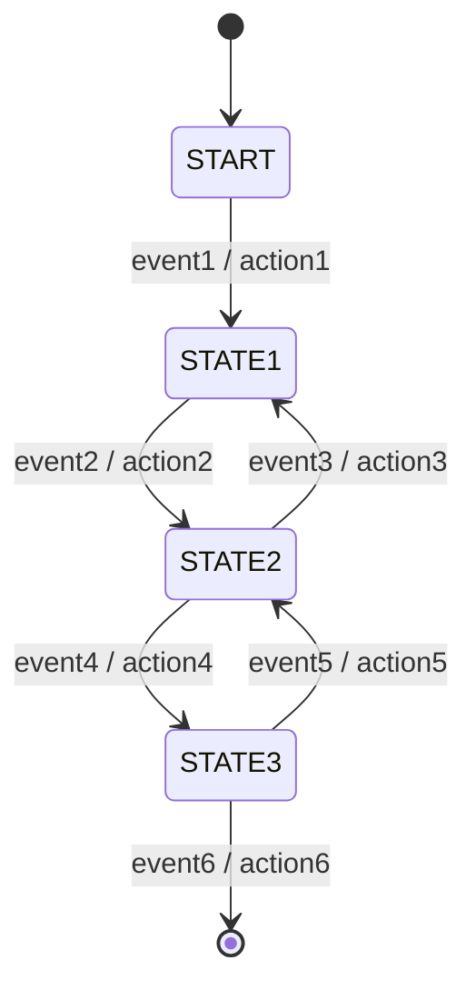
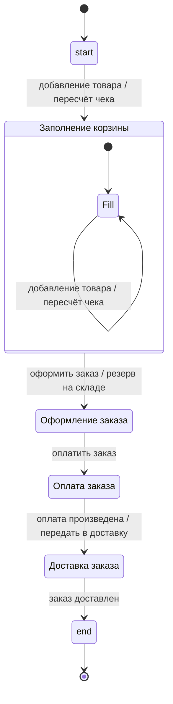

# State Machine Starter + Shop Example

Лёгкая реализация конечного автомата (FSM) на Java с DSL на лямбдах и Spring Boot автоконфигурацией.
Проект состоит из стартер-библиотеки (ядро FSM + AutoConfiguration) и примерного доменного модуля интернет-магазина.

Диаграмма состояний магазина

### Диаграмма 1 — абстрактная «машина состояний»

### Диаграмма 2 — процесс покупки в интернет-магазине
