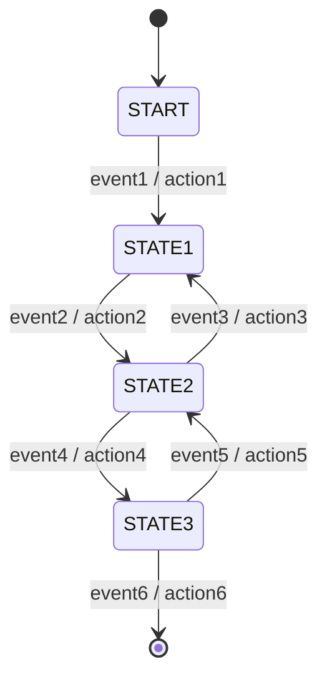

# State Machine Starter + Shop Example

Лёгкая реализация конечного автомата (FSM) на Java с DSL на лямбдах и Spring Boot автоконфигурацией.
Проект состоит из стартер-библиотеки (ядро FSM + AutoConfiguration) и примерного доменного модуля интернет-магазина.

Диаграмма состояний магазина

### Диаграмма 1 — абстрактная «машина состояний»


### Диаграмма 2 — процесс покупки в интернет-магазине
```mermaid
stateDiagram-v2
    [*] --> start

    start --> 'Заполнение корзины': добавление товара / пересчёт чека

    state 'Заполнение корзины' as FILL_CART {
        [*] --> FILL
        FILL --> FILL: добавление товара / пересчёт чека
    }

    FILL_CART --> "Оформление заказа": оформить заказ / резерв на складе
    "Оформление заказа" --> "Оплата заказа": оплатить заказ
    "Оплата заказа" --> "Доставка заказа": оплата произведена / передать в доставку
    "Доставка заказа" --> end: заказ доставлен

    end --> [*]
```